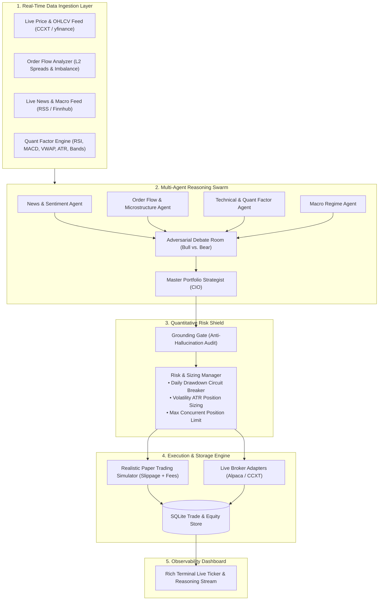

# ⚡ ApexTrader: Autonomous Multi-Agent Quantitative Trading System

ApexTrader is a production-grade, autonomous trading engine built on a **2-Tier Hybrid Architecture**:
1. **The Cognitive Brain (Multi-Agent Swarm):** Synthesizes live financial news, order book flow, technical indicators, and macroeconomic conditions; conducts adversarial (Bull vs. Bear) debates; and formulates grounded trade proposals.
2. **The Execution Muscle (Quant Risk & Fast Execution Engine):** Implements anti-hallucination price grounding, volatility-adjusted ATR position sizing, daily circuit breakers, and sub-second order routing to paper/live brokers.

---

## 🏗️ System Architecture



---

## 🚀 Quick Start

### 1. Installation

Create a virtual environment and install dependencies:
```bash
uv venv
.venv\Scripts\activate      # On Windows (.venv/bin/activate on Linux/macOS)
uv pip install -r requirements.txt
```

### 2. Configuration

Copy `.env.example` to `.env` and add your API keys (optional, fallback heuristic intelligence is active by default):
```bash
cp .env.example .env
```

Review `config.yaml` to customize your trading universe, risk parameters, and timeframe:
```yaml
trading:
  universe:
    - symbol: "BTC/USDT"
      asset_type: "crypto"
      exchange: "binance"
    - symbol: "ETH/USDT"
      asset_type: "crypto"
      exchange: "binance"
    - symbol: "SOL/USDT"
      asset_type: "crypto"
      exchange: "binance"
  timeframe: "5m"
  lookback_candles: 100

risk:
  max_portfolio_risk_pct: 1.5
  max_open_positions: 3
  daily_max_drawdown_pct: 3.0
  risk_reward_ratio_min: 1.5
```

---

## 💻 Running the System

### Single Decision Cycle (Dry Run):
```bash
python main.py --once
```

### Continuous 24/7 Live Event Loop:
```bash
python main.py --iterations 0
```

---

## 🧪 Running Unit & Integration Tests

Run the full pytest suite:
```bash
pytest -v
```

All 16 unit tests verify:
* Technical indicator math (RSI, MACD, Bollinger Bands, ATR, VWAP)
* Real-time order book flow and bid-ask spread imbalance
* Multi-agent debate resolution
* Anti-hallucination Grounding Gate
* Volatility-adjusted Kelly/ATR position sizing
* Daily drawdown circuit breaker and paper execution with auto-triggered Take-Profit/Stop-Loss
